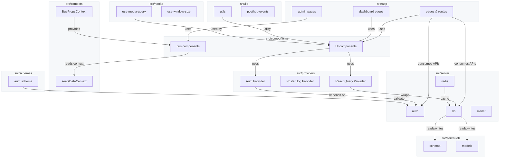

```mermaid
%% Package diagram for BusMate repository
%% Use subgraphs to represent folders/packages and arrows to show dependencies
flowchart TB

	subgraph app [src/app]
		A1[pages & routes]
		A2[admin pages]
		A3[dashboard pages]
	end

	subgraph components [src/components]
		C1[UI components]
		C2[bus components]
	end

	subgraph providers [src/providers]
		P1[Auth Provider]
		P2[PosterHog Provider]
		P3[React Query Provider]
	end

	subgraph context [src/contexts]
		X1[BusPropsContext]
		X2[seatsDataContext]
	end

	subgraph server [src/server]
		S1[auth]
		S2[db]
		S3[mailer]
		S4[redis]
	end

	subgraph db [src/server/db]
		DB1[schema]
		DB2[models]
	end

	subgraph lib [src/lib]
		L1[utils]
		L2[posthog-events]
	end

	subgraph hooks [src/hooks]
		H1[use-media-query]
		H2[use-window-size]
	end

	subgraph schemas [src/schemas]
		SC1[auth schema]
	end

	%% Relationships
	A1 -->|uses| C1
	A2 -->|uses| C2
	A3 -->|uses| C1
	A1 -->|consumes APIs| S1
	A1 -->|consumes APIs| S2
	C1 -->|uses| P1
	C1 -->|uses| P3
	P1 -->|depends on| S1
	P3 -->|wraps| S2
	S2 -->|reads/writes| DB1
	S2 -->|reads/writes| DB2
	S4 -->|cache| S2
	C2 -->|reads context| X2
	X1 -->|provides| C2
	L1 -->|utility| C1
	H1 -->|used by| C1
	SC1 -->|validate| S1

	%% Visual tweaks
	classDef package fill:#f6f8fa,stroke:#dfe4ea;
	class app,components,providers,context,server,db,lib,hooks,schemas package;

```

Notes: This is a high-level package diagram. Adjust boxes or add more sub-packages if you want deeper detail (e.g., split `src/server/db/schema` into specific table files).
